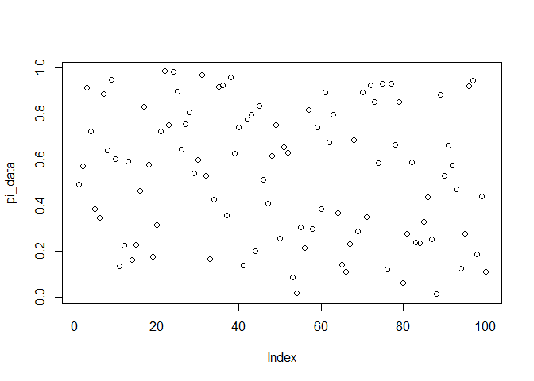

<!-- README.md is generated from README.Rmd. Please edit that file -->

# mbrdt

<!-- badges: start -->
<!-- badges: end -->

The goal of mbrdt is to provide tools for designing multistage binomial
reliability demonstration tests (MRDTs). It allows researchers and
practitioners to simulate and optimize the costs of MBRDT designs,
considering the multi-stage acceptance uncertainties and the potential
subsequent costs of RDT, such as reliability growth costs and warranty
service costs.

## Installation

You can install the development version of mbrdt like so:

``` r
# FILL THIS IN! HOW CAN PEOPLE INSTALL YOUR DEV PACKAGE?
```

## Example

This is a basic example which shows you how to solve a common problem:

``` r
library(mbrdt)
## basic example code
```

What is special about using `README.Rmd` instead of just `README.md`?
You can include R chunks like so:

``` r
pi_data <- pi_sim_beta(M = 100, seed = 10, a = 1, b = 1)
# Display summary of pi_data
summary(pi_data)
#>    Min. 1st Qu.  Median    Mean 3rd Qu.    Max. 
#> 0.01319 0.27647 0.57664 0.53845 0.79647 0.98557
```

You’ll still need to render `README.Rmd` regularly, to keep `README.md`
up-to-date. `devtools::build_readme()` is handy for this. You could also
use GitHub Actions to re-render `README.Rmd` every time you push. An
example workflow can be found here:
<https://github.com/r-lib/actions/tree/v1/examples>.

You can also embed plots, for example:



In that case, don’t forget to commit and push the resulting figure
files, so they display on GitHub and CRAN.
